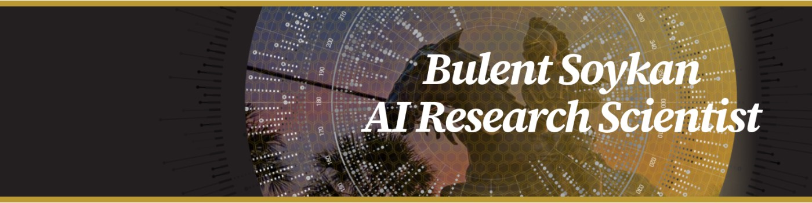

# Hi there, I'm Bulent Soykan 👋

Research Scientist specializing in Operations Research, Applied Mathematics, and Machine Learning

## 🚀 About Me

I'm a research scientist at the Institute for Simulation and Training, University of Central Florida, with extensive expertise in statistical analysis, operations research, applied mathematics, simulation and modeling, machine learning, and strategic planning. As a PMP-certified professional, I bring a proven track record of successful project completion and goal achievement.

### 🔬 Current Research Focus

I'm working on solving large-scale scheduling problems using:
- Mixed Integer Programming (MIP)
- Simulation modeling
- Machine Learning, particularly Reinforcement Learning
- Digital twin design and development

### 🌱 Learning & Growing

- Graph Neural Networks
- Deep Reinforcement Learning for sequential decision-making
- Design and development of digital twins

### 🤝 Let's Collaborate

I'm actively looking to collaborate on projects involving:
- Optimization (MIP)
- Simulation modeling
- Machine Learning (Reinforcement Learning)
- Experimental design

### 💡 Expertise

Feel free to ask me about:
- Mixed Integer Programming (MIP)
- Simulation techniques
- Experimental design methodologies

### 📫 Get in Touch

- **Email**: soykanb@gmail.com
- **Pronouns**: He/him

### ⚡ Fun Fact

I know it's not true, but I truly feel like I'm still twenty years old!

---

*Open to interesting research collaborations and challenging optimization problems!*
